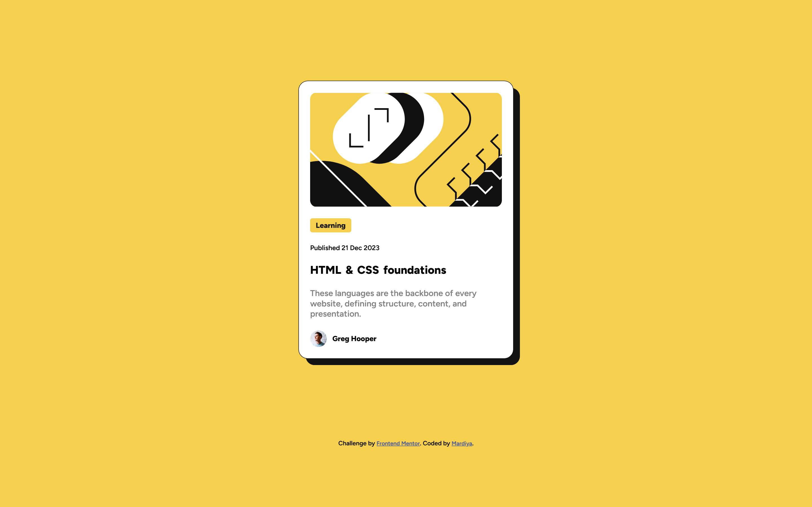

# Frontend Mentor - Blog preview card solution

This is a solution to the [Blog preview card challenge on Frontend Mentor](https://www.frontendmentor.io/challenges/blog-preview-card-ckPaj01IcS). Frontend Mentor challenges help you improve your coding skills by building realistic projects.

## Table of contents

- [The challenge](#the-challenge)
  - [Screenshot](#screenshot)
  - [Links](#links)
  - [My process](#my-process)
  - [Built with](#built-with)
  - [Useful resources](#useful-resources)
  - [Author](#author)

### The challenge

Users should be able to:

- See hover and focus states for all interactive elements on the page

### Screenshot

### Links

- Solution URL: [Solution URL](https://github.com/Mardiya07/FEM-blog-preview-card)
- Live Site URL: [Live Site URL](https://your-live-site-url.com)

## My process

### Built with

- Semantic HTML5 markup
- CSS custom properties
- Flexbox
- Mobile-first workflow

### Useful Resources

- [Example resource 1](https://developer.mozilla.org/en-US/docs/Web/Accessibility/ARIA/Roles/contentinfo_role) - This helped me understand and select suitable aria roles.

## Author

- Frontend Mentor - [@Mardiya07](https://www.frontendmentor.io/profile/Mardiya07)
- Twitter - [@Mardiy_a](https://www.twitter.com/Mardiy_a)
